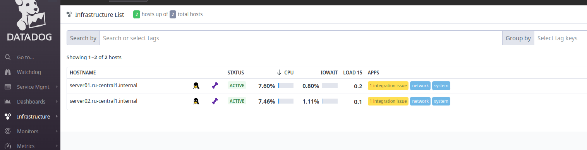

# Deploy project

### Hexlet tests and linter status:
[](https://github.com/QQpy3ko/devops-for-programmers-project-76/actions)

## The app link
[Redmine](https://www.british-isles.ru)

## Requirements

- Docker

- Make

- Ansible


## Instructions

### Deploy

1. Clone repo
2. ```cd repo```
3. Install Ansible Galaxy roles and collections
   ```make install-roles```
4. 
   - a. Check setup play in dry mode (optionally) 
      ```make check-setup```
   - b. Make setup on remote servers
      ```make setup```
5. 
   - a. Check deploy play in dry mode (optionally)
      ```make check-deploy```
   - b. Deploy app on remote servers
   ```make deploy```

### Additionally

Stop all the applications
   ```make stop-app```

Remove unused containers on tremote servers
   ```delete-app```

Make your own password for secrets
   ```make vault-pass```
   .gitignore it!

Make file with secrets
   ```make vault-file```

Encrypt or decrypt it
   ```make encrypt```
   ```make decrypt```

### Added DataDog monitoring

